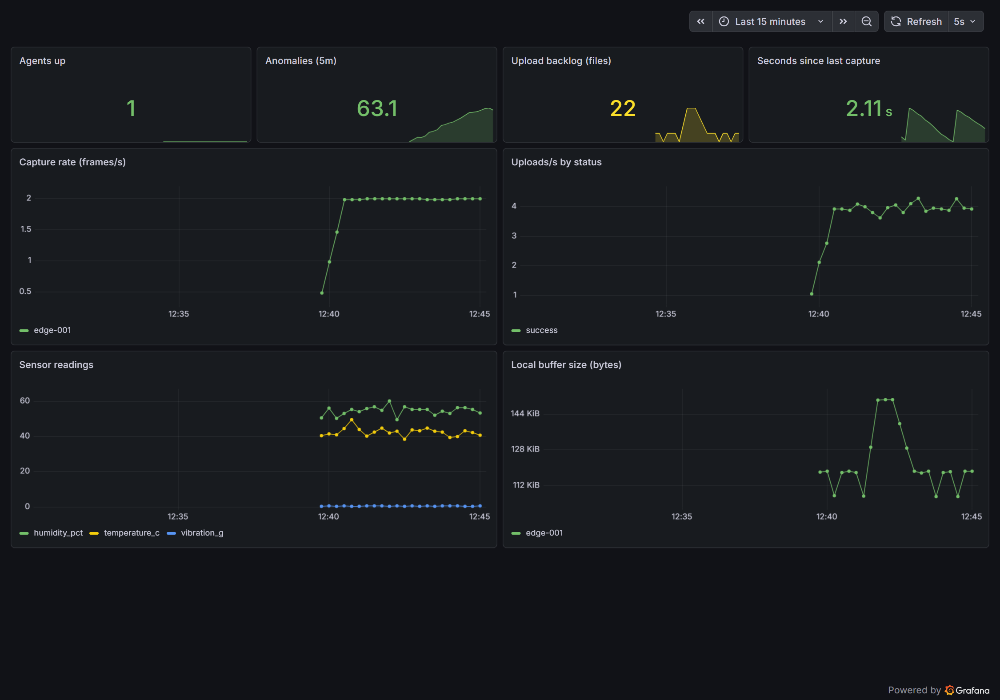

# Edge-to-Cloud Sensor & Camera Data-Collection Platform

[](https://github.com/thanhtrung102/edge-sensor-platform/actions/workflows/ci.yml)

A robotics/manufacturing-style **edge-to-cloud** telemetry pipeline: edge agents capture
**camera frames + sensor readings**, buffer them to local disk for **field/offline reliability**,
upload to **S3-compatible object storage** with retry, and surface **fleet health + alerts** through a
**Prometheus/Grafana** observability stack. Built to mirror the edge + cloud + observability + on-site-ops
shape of a real sensor-data-collection operation — and to run **entirely locally, free, with no cloud account**.

> Designed as an open-source stack that maps 1:1 to AWS: **MinIO→S3, k3s→EKS,
> Prometheus/Grafana→CloudWatch, Loki→CloudWatch Logs, dbt-duckdb→Glue/Athena** — with real
> **Terraform** for the AWS S3 landing target ([`terraform/`](terraform/README.md)).

## Architecture
The agent splits telemetry into **two planes** the way real robot/fleet data collection does
(cf. AWS's *Physical AI for Robotics* reference and Foxglove/MCAP):
```
 EDGE (hardware)                 CLOUD / STORAGE              ANALYTICS            OBSERVABILITY
 Edge Agent (FastAPI)            MinIO (S3 object store)      dbt + DuckDB         Prometheus ─┐
  • camera (synthetic|webcam)     edge-data/                   extract.py (land)    Grafana  ◀─┘ metrics+alerts
  • sensors + anomaly inject       {device}/recordings/*.mcap  marts:          ──▶  Loki/Promtail
     ├─ recording plane  ───────▶   (camera+sensor channels)    capture_health      (structured JSON logs)
     │   → rotated MCAP segments    {device}/sensors/*.json     sensor_quality
     └─ telemetry plane  ───────▶   (scalar readings)           anomalies
  • local ring-buffer (retry, self-healing)  ──▶  (frames recovered from MCAP /camera channel)
  • /metrics + /healthz + JSON logs
```
- **Recording plane** — heavy camera frames are written into **rotated MCAP segments** (the ROS 2
  default bag format; opens in Foxglove). One segment carries both a `/camera/jpeg` and a `/sensors`
  channel with embedded schemas — so the small-files problem is solved *at the source* (hundreds of
  frames → one self-describing object), not compacted after the fact.
- **Telemetry plane** — small, high-rate sensor scalars stay as their own JSON objects (the on-ramp
  to MQTT → AWS IoT Core; migration designed in [docs/ROADMAP-mqtt-iotcore.md](docs/ROADMAP-mqtt-iotcore.md)).

Three deploy targets, same components: **Docker Compose**, **native processes** (no Docker),
and **Kubernetes** (`k8s/` — k3s locally, EKS-portable). A full captured run (every stage, real
data at scale) is in [docs/E2E-RUN.md](docs/E2E-RUN.md).

## Quick start (Docker — zero hardware)
```bash
cp .env.example .env
docker compose up -d --build
```
Then open:
- **Agent health:** http://localhost:8000/healthz   ·   **metrics:** http://localhost:8000/metrics
- **MinIO console:** http://localhost:9001  (minioadmin / minioadmin) — watch objects land under `edge-data/`
- **Prometheus:** http://localhost:9090  (try `rate(edge_frames_captured_total[1m])`; Alerts tab)
- **Grafana:** http://localhost:3000  (admin / admin) → dashboard **"Edge Fleet — Capture & Health"**
- **Loki** (logs): in Grafana → Explore → Loki → `{job="docker", event="sensor_anomaly"} | json`

Run the analytics pass once data has landed:
```bash
docker compose run --rm pipeline      # extract -> landing parquet -> dbt build (marts + tests)
```

## Run natively (no Docker — verified on Windows)
If Docker isn't available, every component runs as a native process. This exact path was verified
end-to-end (agent → MinIO, Prometheus scraping, Grafana dashboard):
```bash
# 1. Agent (venv)
python -m venv .venv && ./.venv/Scripts/python -m pip install -r agent/requirements.txt
S3_ENDPOINT=http://127.0.0.1:9000 S3_BUCKET=edge-data BUFFER_DIR=./buf \
  ./.venv/Scripts/python -m uvicorn agent:app --app-dir agent --port 8000
# 2. MinIO (single binary)        → bin/minio.exe server ./miniodata --console-address :9001
# 3. Prometheus (single binary)   → prometheus --config.file=observability/prometheus.local.yml
# 4. Grafana 13 (grafana.exe)     → GF_PATHS_PROVISIONING=observability/grafana/provisioning-local grafana.exe server
# 5. Loki + Promtail (binaries)   → loki -config.file=observability/loki-config.yml
#                                   promtail -config.file=observability/promtail.local.yml (tails logs/agent.log)
# 6. Analytics (venv)             → cd pipeline && python extract.py && dbt build --profiles-dir .
```
`prometheus.local.yml`, `grafana/provisioning-local/`, and `promtail.local.yml` target `127.0.0.1`
(vs the Docker DNS names in the compose path). Run the agent with stdout redirected to `logs/agent.log`
so Promtail can tail it. Sample rendered dashboard: `observability/grafana-dashboard.png`.



## Use a real USB camera
The default is synthetic capture (works everywhere). For a real webcam, run the agent **natively**
(host webcam isn't reachable from a Linux container on Windows/macOS):
```bash
pip install -r agent/requirements.txt opencv-python-headless
CAMERA_SOURCE=webcam S3_ENDPOINT=http://localhost:9000 BUFFER_DIR=./buf \
  uvicorn agent:app --app-dir agent --port 8000
```

## Demonstrate field reliability (offline buffering) — verified live
```bash
docker compose stop minio        # simulate the object store going offline
# → agent keeps capturing; edge_upload_backlog_files climbs; EdgeUploadBacklogHigh alert fires;
#   agent logs {"event":"backend_unreachable"} to Loki
docker compose start minio       # backlog drains automatically; alert resolves;
#   agent logs {"event":"backend_reconnected","backlog_drained_from":N}
```
Verified end-to-end on the native stack: MinIO stopped → backlog climbed 22→250 → `EdgeUploadBacklogHigh`
went pending (60>50) then **fired** after its 30s `for`; MinIO restarted → backlog drained <50 in ~18s →
alert **resolved**; the whole incident is reconstructable in Loki from the agent's `backend_unreachable`
→ `backend_reconnected` log lines.

## Analytics pipeline (`pipeline/`)
dbt + DuckDB marts over the landed objects (the open-source analogue of Glue/Athena/dbt-on-Athena).
`extract.py` compacts thousands of tiny JSON objects into parquet, then `dbt build` produces
**mart_capture_health**, **mart_sensor_quality**, **mart_anomalies** (+ tests). See [pipeline/README.md](pipeline/README.md).
Verified live: 11,556 readings landed → 6 models, 8 tests pass, 1,040 anomalies independently recovered.

## Kubernetes (`k8s/`)
The whole stack as vanilla Kubernetes: edge agent as a **DaemonSet** (one per node = one per device,
`DEVICE_ID` from the node name), MinIO, Prometheus (pod-discovery scrape + alerts), Grafana, Loki +
Promtail DaemonSet, and a **CronJob** running the dbt pipeline every 15 min. `kubectl apply -k k8s/`
on k3s locally; lifts to **EKS** by swapping MinIO for S3 (IRSA). See [k8s/README.md](k8s/README.md).

## What this demonstrates
- **Data pipeline / object storage** (S3-compatible, partitioned) + **dbt/DuckDB analytics marts**
- **Observability stack** — metrics (Prometheus/Grafana, dead-man's-switch alerts) **and logs** (Loki/Promtail)
- **On-site ops automation** (self-health, auto-restart, offline-tolerant retry, escalation alerts)
- **Cameras/sensors + local storage** (USB-camera-ready, sensor telemetry, local ring-buffer)
- **DevOps / Kubernetes** — Docker Compose, native, and k3s/EKS manifests (DaemonSet + CronJob)
- **CI/CD + IaC** — GitHub Actions (lint · agent tests · dbt build · image build · kustomize validate · `terraform validate`) and **Terraform** for the real AWS S3 landing target (`terraform/`)

## Reliability & correctness details
- **MCAP recording segments** — camera frames are recorded into rotating, self-describing MCAP
  segments (`SEGMENT_SECONDS`/`SEGMENT_MAX_FRAMES`), written to a `*.part` temp and **atomically
  renamed** on seal so the upload loop never ships a half-written segment. Capture time is preserved
  in the message log-time, so frames recovered downstream stay partition-correct.
- **Capture-time partitioning** — objects are keyed by their *capture* time (parsed from the buffered
  filename / MCAP message time), not upload time, so data buffered through an outage still lands in
  the correct `Y/M/D/H` partition (otherwise late arrivals scatter into the wrong hour and break pruning).
- **Bounded store-and-forward buffer** — past `MAX_BUFFER_BYTES` the agent drops oldest-first
  (`edge_buffer_evicted_total`), so a long outage can't fill the disk and take the node down.
- **Self-healing upload loop** — an unexpected error in one upload cycle (transient `MemoryError`
  under pressure, a surprise `OSError`) is caught and retried next interval instead of permanently
  killing the upload thread and silently stranding the buffer.
- **Tested** — `pytest tests/` covers the partitioning and buffer-eviction logic; `dbt test` covers
  the marts. Both run in CI on every push.
